# Peripheral_client


## Example description

This example shows:
- How to configure DA1453x as GATT client
- How to configure mobile phone as BLE server by SmartBond mobile app.
- In this example, Client will search for specific service UUID and receive data from it. 
- In this example, we will configure the characteristic properties to see how to read, write or receive notification from server.
- In this example, we will configure the server to send notifications give the write or read permission to the Client.


# GAP & GATT
It's critical to understand the differences between GAP and GATT.

The general topology of the BLE network stack is specified by GAP.
Once devices have a dedicated connection, GATT goes into detail about the transfer of data (attribute values).
GATT specifically concentrates on how data is packaged, structured, and delivered in accordance with its specified criteria. 
GATT directly sits on top of the ATT protocol in the BLE network stack. 
In fact, GATT employs ATT to explain how data is sent between two connected devices.

We strongly recommend following [Renesas tutorial](https://lpccs-docs.renesas.com/UM-B-119_DA14585-DA14531_SW_Platform_Reference/Software_Platform_Overview/Software_Platform_Overview.html ), to have a better understanding of GAP and GATT layers.


## Service
Services are used to break data up into logical entities, and contain specific chunks of data called characteristics.
Each service distinguishes itself from other services by means of a unique numeric ID called a UUID.


## HW and SW configuration
First step here to configure UART pin:

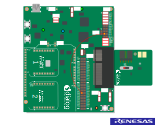


## Program Flowchart on client side:
To Run properly this application, you need to follow these two flow charts, one is to program the client and the other to configure server which in this case is SmartBond application on the phone.

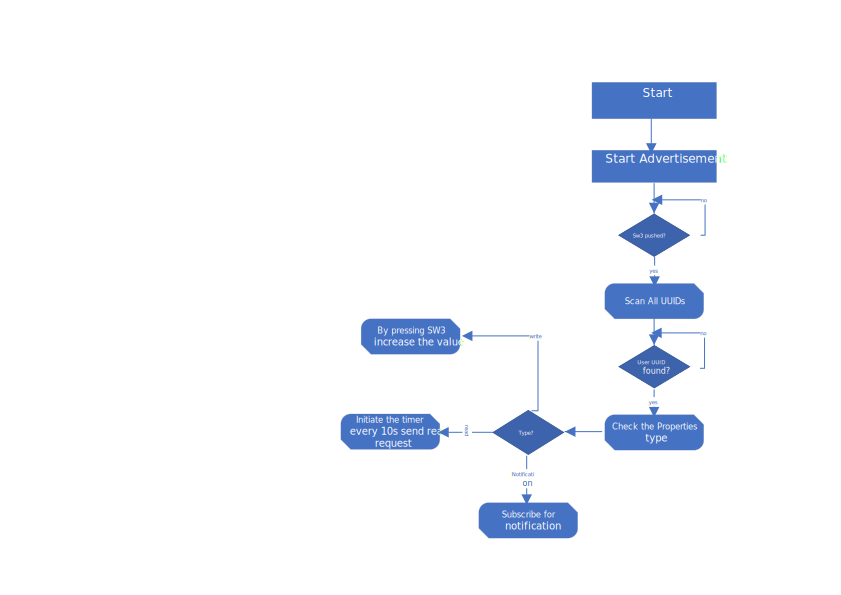

## Program Flowchart on server side:
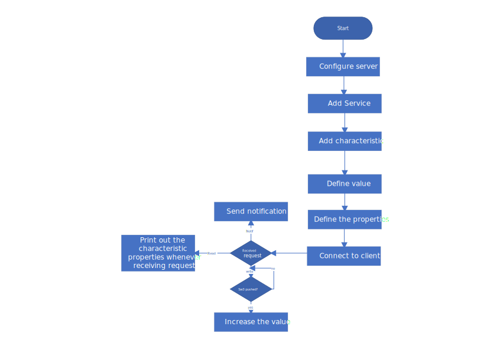


## How to run the example

### Setup
For the initial setup of the project that involves linking the SDK to this SW example, please follow the Readme [here](../../Readme.md).

1. Start Keil using the `peripheral_gatt_client.uvprojx` Keil project file.

2. Expand the dialog shown in the red box in the image below.


  Select your device: DA14531
		
Create a server by Smart bond:

You can download SmartBond from following link:

[SmartBond](https://play.google.com/store/apps/details?id=com.renesas.smartbond&hl=it&gl=US)

1. on the top left corner open the option file and choose server.
   
   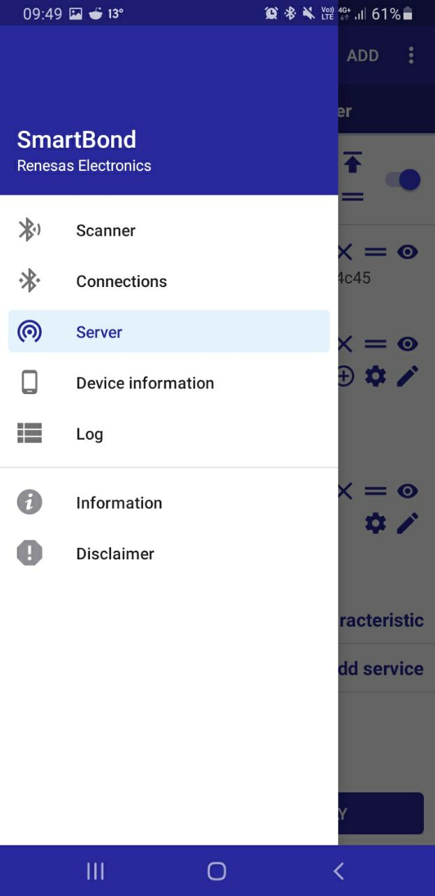

2. You will see the add option on right top corner. press it.

3. give a name to it. Here we choose test
   
4. choose test server and inside give an UUId to your service and give it a name. for example:
    
    UUID: 5052494d-2dab-0341-6972-6f6861424c45
    name: custom

5. Now choose the service and add a characteristic, we named it data ,also give an UUId to it. For example:
    
    UUID: 43484152-2dab-3241-6972-6f6861424c45

6. Let's give it a read properties for the beginning. Just like the following figure choose the options.
   
   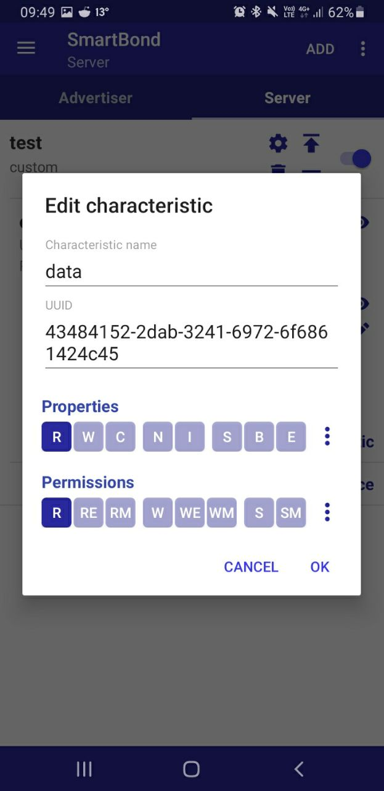

7. Make sure you activate the service by switching on the toggle button

   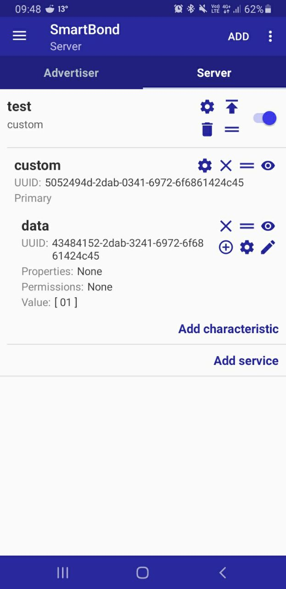   

## Easier way to create a service

In this project you can find the folder `Server_configuration_phone`. You can find the `server_config.json` file. 

 

download it in to your mobile phone and from SmartBond application , server section push option button on the upper right of the screen and choose import. Now find the `server_config.json` and automatically you will have the predefined server and service configuration.

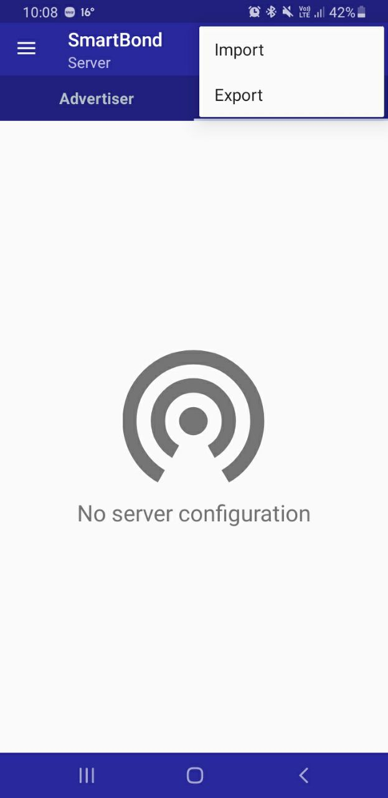 


## Expected Results

Build and run the example on keil. On smartBond scan for GAP_Periph_GATT_Client and connect to it.

    


Meanwhile open TeraTerm and configure Baudrate to 115200. You will see the application will scan all the UUIDs and match with the user UUID which we already defined it in client and in server. 

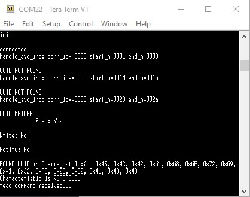

Here you will see after matching to the service UUID, every 10 seconds client will send a read request to server and server will send the response.

```c

void timer_and_read_handler(void) {
    user_gatt_read_simple(matched_char.con_id, matched_char.handle);
    app_easy_timer(1000, timer_and_read_handler);
}

```
You can find this function which is responsible for sending read request to server in `user_profile.c`. Here we used Easy timer and will activate it every 10.

To handle the different flags comming from server refer to `user_catch_rest_hndl` function in same file. Read flag is `GATTC_READ_IND`. You can find other flags in `gattc_task.h`.

Here we can test this example also with write properties. In this case , we define a counter which increase by every time pushing switch 3 on development board. To see this , change the service properties on SmartBond to W and write permission like below:

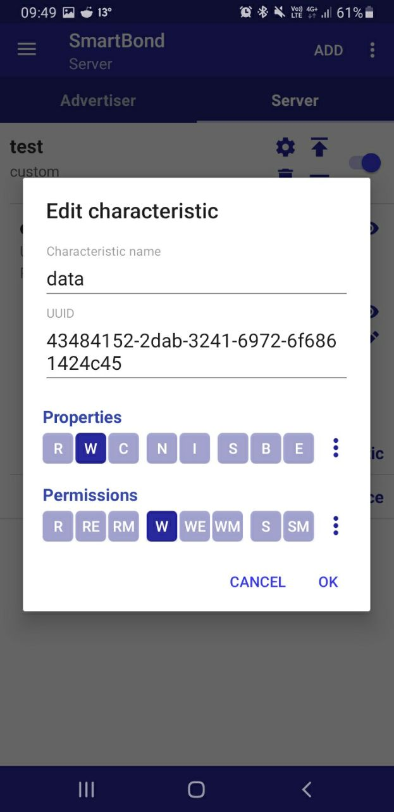

Build and run the application. On tera term you will see this message now. By every time pushing SW3 you will see also and increament on the value in the server.


Now for last part, Lets see how to subscribe and receive notification from server:

first activate the notification on the server.

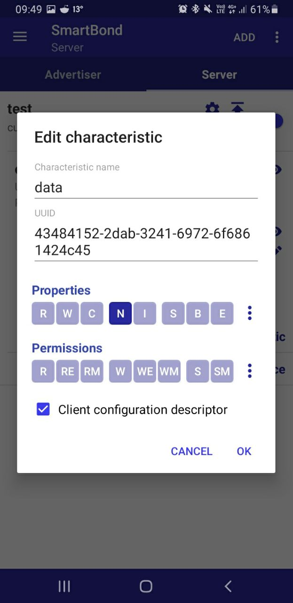

To subscribe for the notification to the server we need to send ccc_value which is a typically a 16-bit descriptor to server. For notification we need to send 0x0001 and for indication 0x0002. Again in `user_catch_rest_hndl` you can see the flag for receive and handle notification after getting paired with device. 
On teraterm You can expect to receive this message:

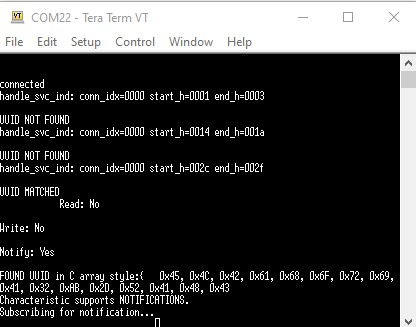

To send the notification by server on your mobile phone after connection go to server section and press on Unknown service you will see the It is showing the notifications enabled.
If it does not , press the button shape icon and activate the notification and now by every time pushing the Bell icon and pushing send you will receive a notification on your terminal.

 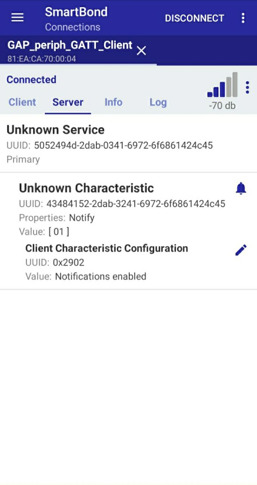

 